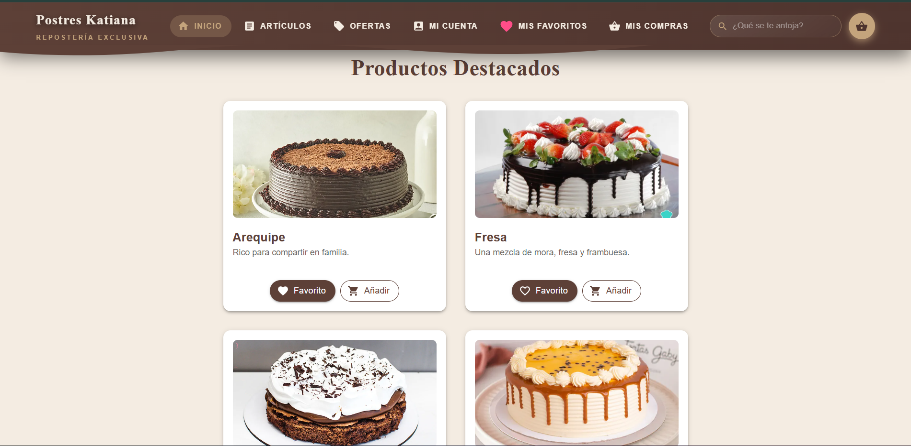

# TE_ESHOP 🛒

**TE_ESHOP** es una plataforma de comercio electrónico moderna desarrollada con **React** y **Vite**. El proyecto sigue una arquitectura modular basada en **Features**, lo que facilita la escalabilidad y el mantenimiento del código, permitiendo una separación clara entre la lógica de autenticación, el diseño global y la visualización de productos.

---

## 🚀 Tecnologías Utilizadas

- **React:** Biblioteca principal para la interfaz de usuario.
- **Vite:** Herramienta de construcción rápida para el frontend.
- **Material UI (MUI):** Framework de componentes para un diseño profesional y responsivo.
- **React Hooks:** Gestión de estado y efectos (useState, useEffect, useRef).
- **PWA Ready:** Configuración preparada para Progressive Web App.

---

## 📂 Estructura del Proyecto

La arquitectura del código se organiza dentro de la carpeta `src` de la siguiente manera:

- **Features/Auth:** Gestión de usuario, incluyendo componentes como `Myaccount`, `Mybuys` y `Myfavorites`. Incluye hooks personalizados como `UseFavoritos`.
- **Features/Layout:** Componentes estructurales globales como `Header`, `Footer` y el contenedor de `Content`.
- **Features/View:** Lógica de visualización principal, gestionando secciones de `Articles` y `Offers`.
- **Utils:** Funciones de utilidad y animaciones compartidas, como `animarFavorito.jsx`.
- **Public:** Recursos estáticos como imágenes y el archivo de configuración `Robots.txt`.

---

## 🛠️ Instalación y Configuración

Sigue estos pasos para ejecutar el proyecto localmente:

1. Clonar el repositorio:

    ```bash
    git clone [https://github.com/tu-usuario/te_eshop.git](https://github.com/drexmezadelaossa/te_eshop.git)
    ```

2. Instalar dependencias:

    ```bash
    npm install
    ```

3. Ejecutar en modo desarrollo:

    ```bash
    npm run dev

    ## 🏛️ Arquitectura y Estructura del Proyecto

El proyecto sigue una estructura modular organizada por niveles de responsabilidad, facilitando el mantenimiento y la escalabilidad del código:

```text
src
│
├── Features
│   ├── Auth
│   │   ├── Components
│   │   │   ├── Myaccount.jsx
│   │   │   ├── Mybuys.jsx
│   │   │   └── Myfavorites.jsx
│   │   ├── Hooks
│   │   │   └── UseFavoritos.jsx
│   │   └── Pages
│   │
│   ├── Layout
│   │   ├── Components
│   │   │   ├── Content.jsx
│   │   │   ├── Footer.jsx
│   │   │   └── Header.jsx
│   │   ├── hooks
│   │   └── pages
│   │
│   └── View
│       ├── Components
│       │   ├── Articles.jsx
│       │   └── Offers.jsx
│       └── Hooks
│
├── Utils
│   └── animarFavorito.jsx
│
├── App.css
├── App.jsx
├── Index.css
└── Main.jsx


 🖼️ Captura de pantalla


  

---

## ✨ Características Principales

- **Gestión de Favoritos:** Sistema integrado para marcar y animar productos preferidos.
- **Diseño Modular:** Componentes reutilizables organizados por funcionalidades.
- **Interfaz Gourmet:** UI/UX optimizada para una experiencia de usuario fluida y estética.
- **Responsive Design:** Adaptable a dispositivos móviles y escritorio.

---

👨‍💻 Datos del Autor

Nombre: Andrés Meza

Programa: Desarrollo de Software / Frontend

Institución: SENA

GitHub: @drexmezadelaossa

🔗 Repositorio oficial

Puedes ver el código fuente y actualizaciones aquí:

https://github.com/drexmezadelaossa/te_eshop.git
